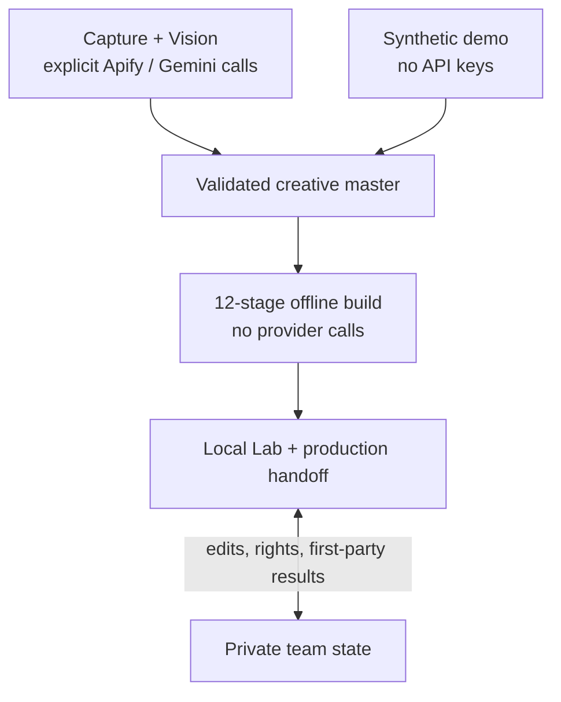

# Creative Research

An evidence pipeline for public creative and distribution research, with a local
browser workspace for creator-team production, asset rights and first-party results.

Version **1.0.0** is the initial public stable release. The supported deployment is
a local research workspace, not a public or multi-tenant service.

It separates observed facts, bounded inferences and unknowns. Research output is
not proof of an operator's private intent, a prediction of success, or permission
to reuse copyrighted media.

## What it does

- Captures public TikTok evidence through explicit Apify commands and interprets
  slides/video through opt-in Gemini Vision stages.
- Builds an operator-aware warehouse, relative performance/cadence baselines,
  creative families, propagation, timelines, patterns and strategy hypotheses.
- Reuses fresh outputs across a deterministic, twelve-stage offline pipeline.
- Produces an evidence-linked Lab and creator-team handoff, retaining private team
  edits outside regenerated research files.
- Provides plain/colored CLI help, machine-readable reports, structured logs,
  actionable errors and a synthetic offline demo.
- Adds a portable Agent Skill for Claude Code/Codex: evidence investigation,
  counterexamples, strategy reports and original production plans via an offline bridge.

## How it fits together



Provider execution, offline research and private team work are separate concerns.
Rebuilding research does not replace current private edits. See
[architecture](docs/architecture.md) for the storage boundaries and
[research workflow](docs/research-workflow.md) for the stage order.

## Quick start — no API keys

Prerequisites: Python 3.11+ and `uv`. Node.js is needed for contributor UI checks;
`ffprobe` is optional for video metadata. Commands below run from the repository root.

```sh
git clone <repository-url>
cd creative-research
uv sync --locked --all-groups
uv run creative-research --version
uv run creative-research doctor
uv run creative-research demo --out ./demo-workspace
uv run creative-research --root ./demo-workspace lab --read-only --open
```

The demo uses eight synthetic posts, never downloads media and refuses to overwrite
a nonempty directory. Missing thumbnails are expected. Its small sample does not
establish statistical or semantic validity. Ctrl+C stops the local server.

For an existing evidence project:

```sh
uv run creative-research --root /path/to/research intelligence-build --dry-run --json
uv run creative-research --root /path/to/research intelligence-build --json
uv run creative-research --root /path/to/research status --json
```

`intelligence-build` starts from an existing validated
`data/05_master/creative_master.parquet` and `config/operators.toml`. It never
scrapes or calls Vision. Missing dependencies block execution before stage writes.
Use `--from-stage` / `--through-stage` to rebuild a bounded slice, or `--force`
when intentionally invalidating cached outputs.

## Agent-assisted research

Install the canonical skill into the project where you run Claude Code or Codex:

```sh
uv run python scripts/install_agent_skill.py --project /path/to/agent-project --target both
```

Invoke `/creative-research` in Claude Code or `$creative-research` in Codex. Supply
the evidence root and engine Python explicitly. The skill investigates existing
tables and drafts evidence-linked reports; rebuild/audit writes require confirmation.
It does not automatically scrape, call Vision, publish or change private team state.
See [Agent Skills](docs/agent-skills.md) for dependencies, discovery, bridge commands,
report validation and host-testing limits.

## Configuration and real research

Environment files are **never loaded automatically**. Copy `.env.example` to a
private `.env`, set only needed credentials, then explicitly pass `--env-file`:

```sh
uv run creative-research --env-file .env doctor
uv run creative-research operator-setup --help
uv run creative-research scrape --help
```

Confirm operator/account grouping before scraping. Apify and Gemini calls can incur
costs; review their command options and budgets before executing. Opening the Lab
does not call providers. Do not commit keys, private configuration, scraped data
or media. The local servers have no authentication and must not be exposed publicly.

## Repository layout

```text
src/creative_research/
  cli/                           app, registry, presentation and command adapters
  pipeline/                      planning, contracts and reusable offline steps
  analysis/                      deterministic table transformations
  capture/                       public-source acquisition and media archives
  vision/                        model analysis and typed response contracts
  production/                    recipes, rights checks and team handoff exports
  references/                    selection, media resolution and table exports
  operating/                     operator registry, private state and outcomes
  workspaces/                    browser exports, HTTP adapters and assets/
  infrastructure/                configuration, paths, logging and shared I/O
tests/<feature>/                 unit and integration regressions by responsibility
skills/creative-research/        portable skill, references, bridge scripts and templates
config/*.example.*               safe configuration templates
docs/                            setup, engineering and research references
data/                            ignored, local evidence and generated artifacts
```

The supported interfaces are the documented CLI, canonical evidence schemas and
workspace exports. Python modules are implementation details, not a versioned SDK.
See [architecture](docs/architecture.md) for import boundaries and placement rules.

## Development

```sh
make check                       # lint, formatting, types, tests, coverage and UI
make build                       # distributions plus source/asset verification
uv run creative-research intelligence-build --help
make release-check               # fresh wheel/sdist installs and offline runs
```

CI uses the lockfile, a Python 3.11/3.13 matrix, branch-coverage floor and packaged
asset verification. Passing these checks does not certify live provider behavior,
public-server security or large-corpus performance.

## Documentation

- [Installation](docs/installation.md), [configuration](docs/configuration.md),
  [CLI reference](docs/cli-reference.md), [troubleshooting](docs/troubleshooting.md).
- [Contributing](CONTRIBUTING.md), [architecture](docs/architecture.md),
  [development](docs/development.md).
- [Research workflow](docs/research-workflow.md), [all documentation](docs/README.md).
- [Agent Skills](docs/agent-skills.md): Claude Code/Codex installation and safe AI research.
- [Security](SECURITY.md).

## License and scope

[MIT](LICENSE) covers project code and documentation, not third-party media.
Source assets require separate rights clearance. Provider behavior and costs depend
on external services; offline tests do not certify live models or scraped evidence.
Public deployment, concurrent multi-process writes and unbounded corpora are not
supported. See [security](SECURITY.md) and [development](docs/development.md).
