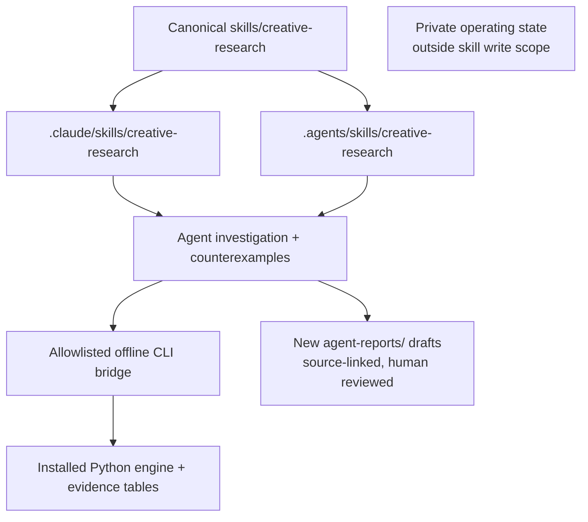

# Portable Agent Skill

`skills/creative-research/` is the canonical agent-facing layer. It guides investigation
and original planning; the separately installed Python engine still owns every
deterministic metric, pipeline stage, CLI contract and Lab export. No algorithm or
evidence schema is replaced. This is a local workflow, not an autonomous service.



## Install into an explicit project

Python 3.11+ is required. From this repository, install pinned engine/development
dependencies, then copy the skill into the project where you will start the agent:

```sh
uv sync --locked --all-groups
uv run python skills/creative-research/scripts/doctor.py
uv run python scripts/install_agent_skill.py --project /path/to/agent-project --target both
```

Use `--target claude` or `--target codex` for one host. The destination must already
exist. Installation never calls providers, installs dependencies automatically,
guesses home paths or replaces existing skills. Move/preserve an old installation
explicitly before reinstalling. Only `skills/` is maintained; discovery copies are
generated and ignored in this repo. Updates require recopying the canonical source.

For an independently installed wheel, use Python from that environment:

```sh
python scripts/install_agent_skill.py --project /path/to/agent-project --target codex --python /path/to/engine-venv/bin/python
```

The wheel contains the engine; the public source distribution/snapshot includes
the skill and installer. The copied skill has no dependency on its original checkout
path, but **does require the installed engine**. `uv` is optional after installation.

## Host discovery and invocation

Start the host in the destination project. Claude Code discovers project skills in
`.claude/skills/`; invoke `/creative-research`. Codex discovers repository skills in
`.agents/skills/`; invoke `$creative-research` or select it from the skill picker.
Confirm the skill appears before relying on automatic selection. If absent, restart
the host and check workspace trust, version/policy and installed path. See official
[Claude Code discovery](https://code.claude.com/docs/en/skills) and
[Codex discovery](https://learn.chatgpt.com/docs/build-skills).

Example request (include actual paths):

> Use creative-research with evidence root /path/to/research and engine Python
> /path/to/engine-venv/bin/python. Investigate OP1 performance, creative families
> and cadence, compare three rival hypotheses, then draft an original 30-day
> experiment plan. Do not acquire data, call providers or change private team state.

These are documented host conventions, not a guarantee that every host/version
loads the skill. Agent inference uses the host's model/account and is distinct
from the bridge's offline engine execution. Any paid host-model testing needs
the user's authorized account/budget; CI does not run model calls.

## Bridge reference

Invoke scripts with the engine's Python and resolve the script from the loaded skill
directory, not the evidence root. Global options precede the subcommand:

```sh
python /path/to/installed-skill/scripts/run_cli.py --root /path/to/research status
python /path/to/installed-skill/scripts/run_cli.py --root /path/to/research validate
python /path/to/installed-skill/scripts/run_cli.py --root /path/to/research query data/06_analytics/post_performance.parquet --columns post_uid,views --limit 20
python /path/to/installed-skill/scripts/run_cli.py --root /path/to/research rank-posts --top 20
python /path/to/installed-skill/scripts/run_cli.py --root /path/to/research intelligence-build
```

`--python` selects another engine interpreter. Inputs are confined to the explicit
root, including resolved symlinks; queries read tables in `data/`, not operating
state. Query `--where` is repeatable; `--limit`/rank `--top` are 1–100 (default 20).
No arbitrary command/flag passthrough, shell execution or query output path exists.
Query/ranking float displays use 17 significant digits for source-value round trips;
this changes presentation only, not filtering, ranking or computed metrics.

`intelligence-build` defaults to read-only planning. After a user approves generated
output writes, add `--execute --approve-write`; optionally `--through-stage cadence`
for a bounded prefix. It never scrapes or runs Vision, even when rebuilding.
`quality-audit --approve-write` writes the existing generated quality report.
Approval flags record a decision, not permission to invent one. Write commands
reject symlinked data/config trees and retain the engine's single-writer limitation.
Use a copied workspace if existing evidence was adopted through symlinks.

Output is a JSON envelope containing engine `stdout`/`stderr`, exit code, timeout,
truncation and `untrusted_output`. Default capture is 64 KiB per stream; reduce with
`--max-output-bytes` (1024–65536). Default timeout is 120 seconds; `--timeout` accepts
1–3600 seconds. A truncated table/report is incomplete: narrow the query; do not
interpret absent rows or truncated JSON. Exit codes: engine status preserved,
invalid bridge input/dependency 2, timeout 124, interruption 130. Credentials/import overrides are
not passed to the engine and `.env` is never loaded. This is a safety adapter,
not an OS sandbox against malicious Python packages or unsafe local table files.

## Reports and quality limits

Draft in chat unless saved output is requested. New Markdown/JSON pairs go only
under `<root>/agent-reports/`, outside warehouse and private operating state.
Never overwrite existing work. Read the bundled evidence contract and templates.
Run `validate_report.py --root /path/to/research agent-reports/<name>.json` with the
engine Python. It checks structure, row IDs and exact copied values; it cannot prove
causality, semantic entailment, replication, rights or correctness of uncited prose.
Source budgets: 64 MiB/table, 16 tables, 128 MiB total; report limit 512 KiB.

## Verification and troubleshooting

```sh
uv run skills-ref validate skills/creative-research
uv run python -m pytest tests/skills -q
make check
make release-check
```

The validator is locked to the official Agent Skills reference repository commit;
it is development-only, not part of the engine runtime. CI runs spec validation,
bridge/installation/report regressions and five fixture scenarios: full data,
missing data, singleton pattern, conflicting metrics and unsupported inference.
Those deterministic contract tests are **not** measured AI reasoning evaluations.
Forward-use review with a real agent and host discovery/invocation are separate
checks; record host/model versions, commands, outputs and limitations in the PR.

Local forward-use QA used all five raw scenarios independently of the expected
rubrics. It produced source-linked strategy and original production drafts, both
passing sidecar validation; source/config fingerprints were unchanged. That is a
bounded qualitative review, not a benchmark. Codex CLI 0.145.0 discovered the
repo-scoped skill through `skills/list` without a model turn. Claude Code 2.1.31
stopped at first-run setup; Claude discovery and full model-driven invocation on
either host remain merge-verification gaps. Direct copied-script invocation is
tested separately and is not substituted for those host checks.

Missing engine: select its Python, run doctor, install explicitly. Missing data:
check status/validate and request the absent evidence; never auto-scrape. Source
metric mismatch: copy the exact table value, not a rounded display approximation.
Unsafe path/write refusal: use an isolated copied workspace and obtain scoped
approval. Provider/network execution, live TikTok/Gemini quality, public deployment
and interactive Lab QA are not certified by this skill's offline tests.
