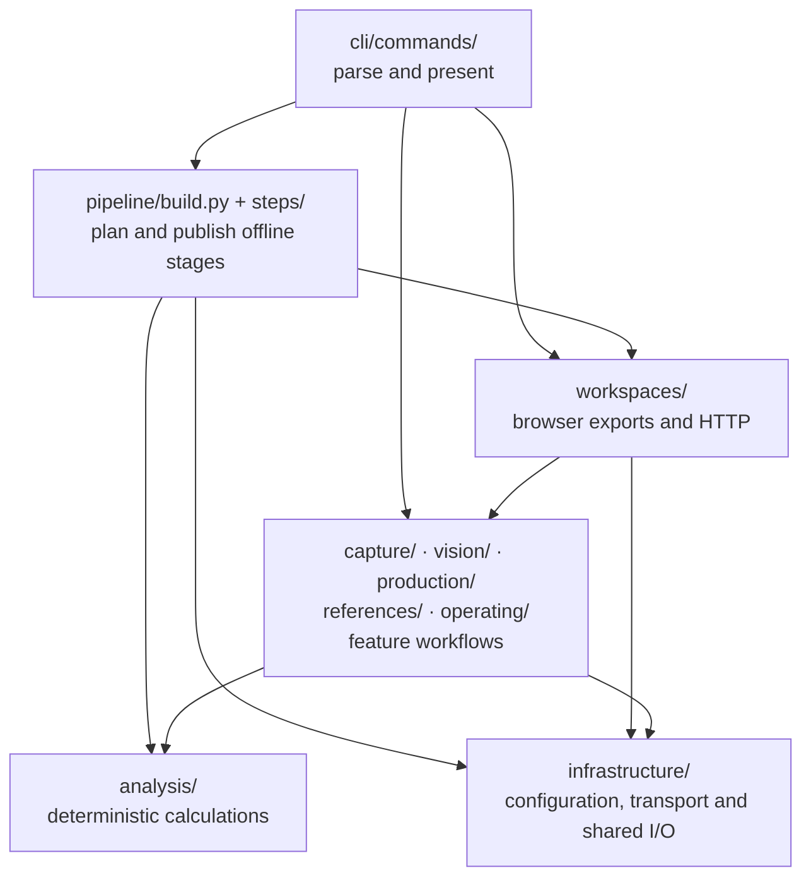
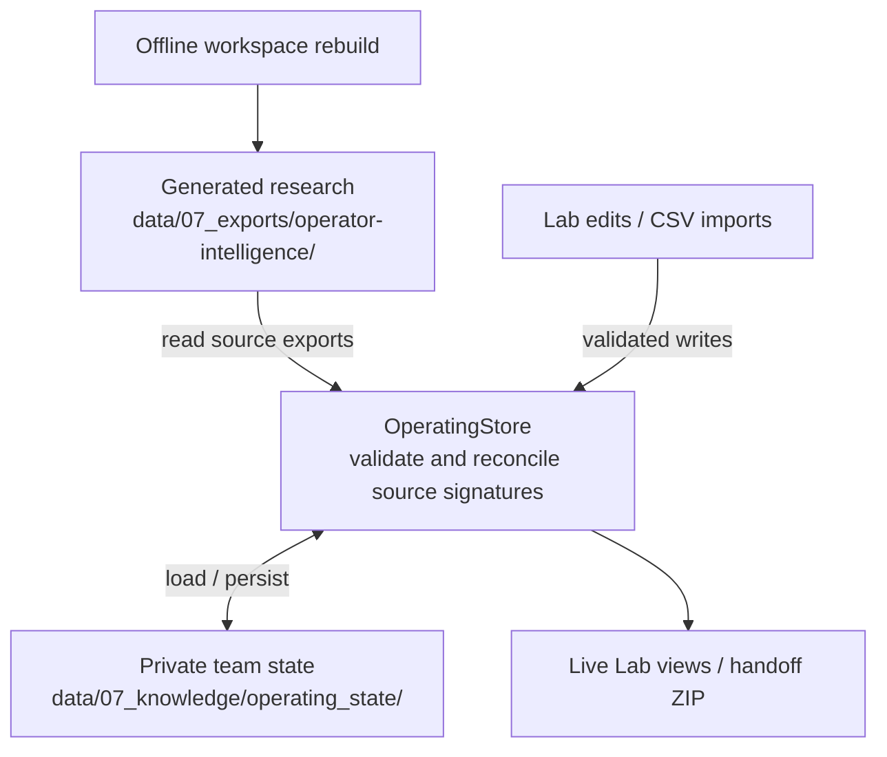

# Architecture

## Scope and boundaries

Creative Research is a single-user, filesystem-backed Python research application,
not a multi-tenant web platform. Pandas/Parquet hold canonical data; JSON provides
browser exports; TOML declares local operator/review configuration. Workspaces use
packaged vanilla JavaScript, CSS and HTML. No database or application framework is
required for the current deployment model.

The [README overview](../README.md#how-it-fits-together) shows the user-facing flow;
the [research workflow](research-workflow.md#offline-analysis-and-inspection) shows
offline stage order. The diagrams below focus on code ownership and storage.

## Module responsibilities

- `cli/app.py` owns global options and top-level error/exit handling. `cli/registry.py`
  generates dispatch/help from one catalog; `cli/commands/` parses command arguments
  and presents results. It does not own provider execution, table algorithms or HTTP handlers.
- `pipeline/build.py` plans dependencies and executes reusable `pipeline/steps/`
  workflows. Steps coordinate table loading/publication; `analysis/` owns deterministic
  transformations. `pipeline/contracts.py` declares schema/files/input flags once.
- `capture/` owns public-source acquisition and media archives; `vision/` owns typed
  response models and opt-in model workflows. `analysis/family_judgments.py` handles
  evidence/prompt/cost planning; `vision/family_judging.py` enforces cache/retry/budget rules.
- `production/`, `references/` and `operating/` group the actual business capabilities:
  production briefs/handoffs, reference selection/media, and operator/team state/outcomes.
- `workspaces/` composes browser exports and adapts HTTP requests to business services.
  Its `assets/lab/` and `assets/references/` are loaded with `importlib.resources`,
  copied into generated exports and included in distributions.
- `infrastructure/` isolates explicit environment parsing, validated settings,
  application logging, atomic publication, source dependency discovery, Gemini
  connection/configuration management and local HTTP.

Package root contains only bootstrapping/version, shared constants, errors and identity
primitives. Tests mirror these responsibilities under `tests/<feature>/`.

## Import direction and placement

CLI adapters call feature workflows; workflows call domain calculations and shared
infrastructure. Business/infrastructure code must not import `cli/` or `argparse`.
Pure analysis must not import provider clients. Architecture tests enforce these
boundaries, provider placement, root contents, import side effects and absence of cycles.

Arrows show selected caller-to-callee relationships, not every import. The feature
box groups existing packages; it is not another shared layer. Root primitives are
omitted. No business module points back to the CLI.

Do not add generic `core/`, `services/` or `utils/` layers. Put behavior next to its
own capability; separate parsing/HTTP from processing, and table publication from
pure calculations. Keep related table export operations together in `references/export.py`.

## Orchestration and freshness

`PipelineConfig` normalizes root-relative paths and validates the IANA timezone.
`StageSpec` declares inputs, required outputs, immutable execution parameters,
display arguments and report expectations.
Planning preflights the whole selected range. An upstream rebuild invalidates its
dependents; a missing input outside that range blocks execution. Code dependencies
include transitive local imports and packaged static assets.

Freshness is based on nanosecond mtimes and declared report parameters, not complete
content hashing. A running marker forces replay after interrupted/failed publication.
Execution retains partial results for the diagnostic report. The default runner
calls each declared workflow's typed `run(...)` function directly in a scoped project
context. It never imports CLI adapters or changes `sys.argv`/cwd. CLI-only
`cli/runtime.py` scopes legacy parser invocation for individual command dispatch.

## Generated research and private team state

Default paths are shown. Current private state lives outside the regenerated export
tree. Source changes invalidate affected review gates instead of silently approving
old work; edits and historical rights/outcome records remain available. Legacy
embedded outcomes and attestations are migrated before replacing old exports.

## Persistence and failure semantics

Table/report publication writes to a sibling temporary file, fsyncs it and replaces
the destination. Readers see the prior or new complete file. This is **single-file**
atomicity, not a transaction over an entire stage; markers make incomplete runs
detectable. Append-only JSONL checkpoints can have a partial final line after a crash.
Readers are strict by default; resumable caches and optional media metadata explicitly
allow recovery, logging file/line locations without record contents. Permission and
unexpected I/O failures propagate rather than looking like empty evidence.

Gemini clients have explicit HTTP timeouts and close on success, failure or interrupt.
Only transport failures and transient HTTP statuses are retryable; invalid schemas
and programming errors are not. Vision commands return exit code 1 after publishing
failure diagnostics and retain successful checkpoints for the next run. Manifest-derived
output paths are preflighted before opening a provider connection.

Reference media/details are staged before replacement; existing trees remain in
hidden `.media.backup-*` / `.details.backup-*` sibling directories. Publication errors
restore the previous tree. The two renames are not crash-atomic: stop writers before
recovering a backup. Binary exports and final JSONL/CSV files use atomic file writes.

The operating store serializes threads with process-local locks and private
file permissions. It does not provide multi-process locking. Run only one writer per
project. `adopt --replace` stages the new artifact before moving the old one to a
recoverable sibling backup; publication failures restore the old destination.

## Security and scaling decisions

Local servers accept loopback binds only, cap concurrent workers, bound socket reads,
confine static paths and drain workers on shutdown. JSON mutation routes validate
size, content type and origin. Paid providers run only through explicit capture/Vision
workflows; the offline build does not call them.
These controls do not make the server suitable for public deployment.

Keep research, publication rights and first-party experiments distinct. Do not turn
descriptive correlations into causal claims or automatic asset licenses. Larger
corpora need measured memory/runtime budgets before replacing in-memory dataframe
processing. A database/job queue/authenticated service is a future requirement only
if multi-user or distributed operation becomes an actual product requirement.
