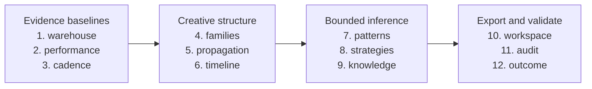

# Research workflow

## Supported scope

Capture public TikTok evidence, interpret creative structure, analyze one declared
operator across accounts, inspect source-linked findings and prepare original team
content. Separate observation, inference and unknowns. Historical correlations are
not causal proof, success predictions or asset licenses.

The offline pipeline never scrapes or invokes models. The Lab provides research,
production edits, rights checks and first-party results; it has no model-call or
human-truth-approval controls. Optional CLI knowledge review annotates a separate
catalog without making operator intent known.

## Capture and interpretation

Create a private account list and explicitly confirm the grouping. Example handles
are fake; replace them with authorized research inputs. Set provider credentials
through process variables or an explicit environment file, never in source.

```sh
creative-research operator-setup --accounts-file config/target_accounts.txt \
  --operator-id OP-001 --name "Research operator" --confirm-same-operator
creative-research scrape config/target_accounts.txt --preflight
```

Preflight is read-only. The following commands access external services; scrape and
Vision can incur costs. Inspect help, sample limits, retries and budgets first.

```sh
creative-research scrape config/target_accounts.txt --out data/00_raw/apify/run-001
creative-research select-accounts --sources data/00_raw/apify/run-001 \
  --accounts creator_alpha creator_beta --out data/01_selected/targets
creative-research prepare-media data/01_selected/targets --out data/02_media/tiktok
creative-research manifest-slides data/02_media/tiktok --out data/03_manifests/slides
creative-research vision-slides data/03_manifests/slides/full_manifest.csv \
  --out data/04_vision/slides
creative-research download-videos data/02_media/tiktok --out data/03_video_media
creative-research vision-videos data/03_video_media/video_manifest.csv \
  --out data/04_vision/videos
creative-research build-master --slides data/04_vision/slides/creative_study_v2.parquet \
  --videos data/04_vision/videos/creative_video_study.parquet --out data/05_master
creative-research validate
```

Select an available Gemini model with `--model` before running Vision. These recipes
describe the command contract, not a guarantee of current provider availability.
Keep raw evidence/checkpoints; partial failures must not be mistaken for complete
capture. `build-master` accepts empty canonical input tables for absent content types.

## Offline analysis and inspection

```sh
creative-research intelligence-build --dry-run --json
creative-research intelligence-build --json
creative-research lab --read-only --open
creative-research quality-audit --strict
creative-research outcome-audit --help
```

The pipeline plans all selected stages before writing, then visits these twelve
stages in order. Names below are the values accepted by `--from-stage` and
`--through-stage`.



Boxes group **execution order**, not all data dependencies or parallel jobs. `audit`
checks upstream tables/reports and workspace files; `outcome` checks workspace
acceptance inputs, not the audit report. Fresh outputs are reused; code/config/input
changes invalidate dependents. Inspect `--dry-run --json` for each stage's actual
inputs, outputs and rebuild reason. Use a bounded range only when its external
inputs already exist. None of these stages scrapes or invokes a model.

Family schema/model identifiers are data contracts, not package versions. Strict
families remain calibration controls for the hybrid model. `calibrate-families` and
`preview-families-v2` are offline diagnostics; `judge-family-candidates --dry-run`
plans optional paid pair judgments without calling a model. A real judge call needs
an explicit key and budget review. Cached judgments never trigger a model in builds.

For reference sampling:

```sh
creative-research extract-references data/05_master/creative_master.parquet \
  --out data/07_exports/references --strategy system --top 30 --media remote
creative-research references --dir data/07_exports/references --open
```

System-balanced suggestions prevent large accounts dominating the sample; they do
not independently validate a creative strategy. `query`, `rank-posts` and
`group-references` support focused inspection. Use each command's help for filters.
Group performance rates exclude missing observations; a group with no usable
observations has an unknown rate, not zero performance.

## Production and durable results

The Lab supports account setup, original slide edits, publishing slots, asset
clearance and first-party outcomes. Export using `production-kit` or the live handoff.
Check `production-kit --help` for CSV import options and separate rights assertions.
Never mark assets publishable without proof and editorial checks.

Private state survives generated-workspace rebuilds. Source changes invalidate
review gates; recheck affected work explicitly. Imported historical outcomes and
rights attestations remain visible but cannot silently become comparable validated
results. There are no database migrations; do not delete private state during cleanup.
